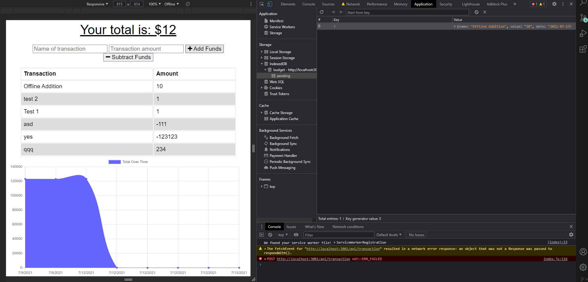

# Budget Tracker

## Description
I refactored a a budget tracker and implemented files that allowed for offline usage. A service worker was used to store data in the browser that could later be picked up by the browser once internet was reconnected. 

## How to Use

Users are able to test the offline feature by following these steps.
1. Open Application
2. Inspect
3. Navigate to network
4. Update No Throttling -> Offline
5. Add or Subtract funds from application
6. Navigate to Application -> Storage -> IndexedDB -> Budget -> Pending
    a. You should be able to see the stored inputted information here.
7. Navigate back to network and switch from offline to no throttling.
8. Refresh page.

Once all these steps are completed, users should have the changes made offline still visible when they connect online.

## Tools Used
MongoDB Atlas
Service-Workers

## Access

Users can access the application via the Heroku Link. Users may view the code via Github.

https://github.com/vegaryanneil/18-PWA

https://bref-bastille-06557.herokuapp.com/

## Resources
Tutor - Juan Delgado